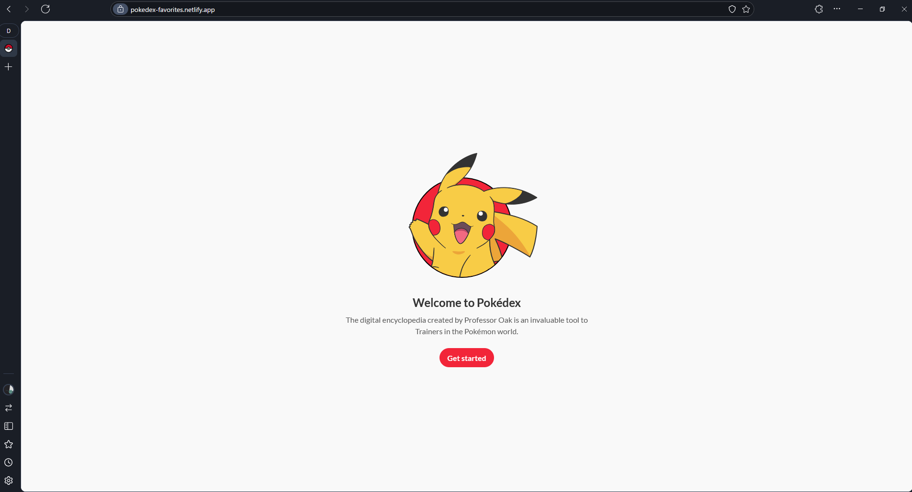
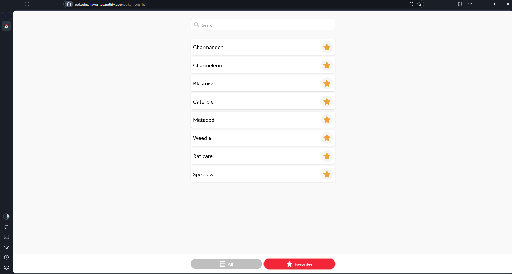
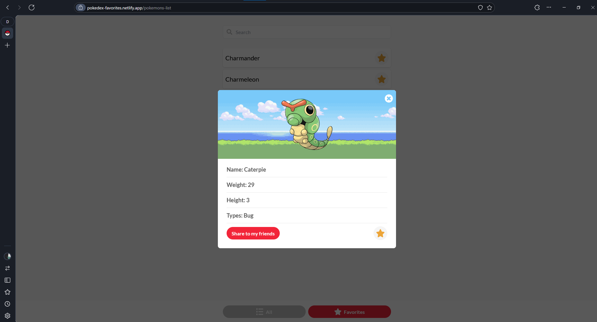

# Pokémon Favorites

## Descripción

Pokémon Favorites es una aplicación frontend desarrollada en Vue.js que permite a los usuarios crear una lista de sus pokémons favoritos. El diseño de la aplicación sigue las especificaciones de Global66 y utiliza la API de PokeAPI para obtener la información de los pokémons.

## Enlace de Despliegue

Puedes probar la aplicación en el siguiente enlace: [Pokémon Favorites](https://pokedex-favorites.netlify.app/)

## Características

- Lista de pokémons favoritos.
- Carga de información de pokémons desde PokeAPI.
- Efecto de carga con una pokebola animada.
- Compartir información de un pokémon en el portapapeles.
- Persistencia de datos en el store de Vue.js.

## Tecnologías Utilizadas

- **Framework**: Vue.js (v3.4.29)
- **Estado**: Pinia (v2.1.7)
- **Rutas**: Vue Router (v4.3.3)
- **Estilos**: Tailwind CSS (v3.4.11)
- **Compilación y Desarrollo**: Vite (v5.3.1)
- **Tipo de Datos**: TypeScript (v5.4.0)
- **Linting**: ESLint, Prettier
- **Testing**: Vitest
- **Ecosistema**: @vue/test-utils, vue-tsc, jsdom, @vitejs/plugin-vue, etc.

## Instalación y Configuración

Para configurar este proyecto localmente, sigue los siguientes pasos:

1. Clona el repositorio:
    ```bash
    git clone https://github.com/aalvag/pokemon-favorites.git
    cd pokemon-favorites
    ```

2. Instala las dependencias:
    ```bash
    npm install
    ```
    
3. Inicia el servidor de desarrollo:
    ```bash
    npm run dev
    ```

## Guía de Uso

1. **Visualización de Pokémons**:
    - La aplicación muestra una lista de pokémons que se pueden agregar a la lista de favoritos.
    
2. **Agregar a Favoritos**:
    - Haz clic en cualquier pokémon para agregarlo a tu lista de favoritos.
    
3. **Compartir Pokémon**:
    - Utiliza el botón de compartir para copiar la información del pokémon al portapapeles.

## Capturas de Pantalla

### Página Principal
<!-- public/pagina-principal.png -->



### Lista de Favoritos



### Compartir Pokémon



## Video de Demostración

Puedes ver un video de demostración de cómo funciona la aplicación aquí: [Video de Demostración](https://url-a-tu-video.com)

## Scripts Disponibles

- `npm run dev`: Inicia el servidor de desarrollo de Vite.
- `npm run build`: Realiza la compilación del proyecto.
- `npm run preview`: Vista previa de la aplicación construida.
- `npm run test:unit`: Ejecuta las pruebas unitarias con Vitest.
- `npm run lint`: Ejecuta ESLint para revisar el código.
- `npm run format`: Formatea el código fuente utilizando Prettier.
- `npm run type-check`: Realiza una verificación de tipos con vue-tsc.

## Pruebas

Para ejecutar las pruebas unitarias, utiliza el siguiente comando:

```bash
npm run test:unit
